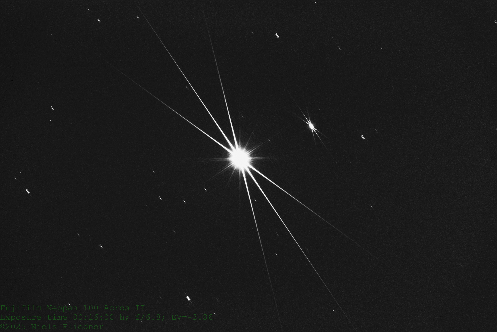

**THIS IS A DRAFT**

My first tests with Deep Space Object (DSO) were successfull... kinda.

# Parameters

- $$TM$$: Measured exposure time
- $$TA$$: Adjusted exposure time, with reciprocity failure correction applied
- $$\text{EV_100}$$: The exposure value with reference to ISO 100. This value is calculated using $$TM$$, so before reciprocity failure correction.

# The Setup

## Cameras

I used two cameras of the same model, one for finding the focus and one for taking the actual shots.

### Focussing Camera

- Minolta X-700
- Back removed
- Added Nikon Focussing screen (cheapest available option) with 3D-printed mounting frame

### Film-holding Camera

- Minolta X-700

## Teleskope

- PlaneWave CDK17 Astrograph f/6.8
- Mount adapter 2" to T2
- Mount adapter T2 to Minolta SR-mount

### Tracking

## Film

- Fujifilm Neopan 100 Acros II, ISO 100, shot at box speed

# Steps

## Finding Focus

- Choose a star field with stars of varying brightness, but at least one very bright star
- Add Bahtinov mask to teleskope
- Find focus using camera with open back and focussing screen added
	- Used 12x loupe for actually seeing the Bahtinov interference pattern, still difficult
- Write down stepper settings for repeatability

## Taking Shots

# The Results

## Bahtinov Interference Pattern Tests

Exposure time ($$TA$$): 00:16:00 h ($$TM$$: 00:11:17 h, $$\text{EV_100}$$: -3.86)

---

Exposure time ($$TA$$): 00:21:34 h ($$TM$$: 00:15:13 h, $$\text{EV_100}$$: -4.29)

---

Exposure time ($$TA$$): 00:14:30 h ($$TM$$: 00:10:15 h, $$\text{EV_100}$$: -3.72)

---

Exposure time ($$TA$$): 00:02:03 h ($$TM$$: 00:01:27 h, $$\text{EV_100}$$: -0.9)

---

Exposure time ($$TA$$): 00:04:10 h ($$TM$$: 00:02:57 h, $$\text{EV_100}$$: -1.92)

## Starfield Test

Exposure time ($$TA$$): 00:45:00 h ($$TM$$: 00:31:56 h, $$\text{EV_100}$$: -5.36)

# How to Improve

- Use digital camera with macro lens and a few seconds of exposure to read the interference pattern from the focussing screen
- Need to fix tracking